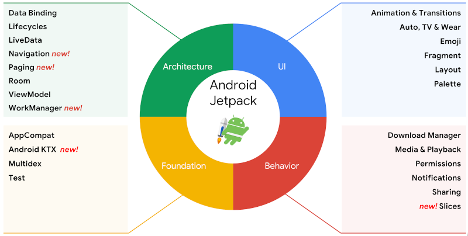

# Demo Nav - Modern Android app navigation

Demo project to reinforce and share techniques, components, and libraries
for implementing navigation in a modern Android application

## Principles of Navigation
1. Apps have a fixed start destination  
1. Navigation state is represented as a stack of destinations  
1. Up and Back are identical within your app's task  
1. The Up button never exits your app  
1. Deep linking simulates manual navigation  

## Tools of Navigation
1. Navigation Component
1. Navigation graph
   1. destinations and actions
1. NavHost
1. NavHostFragment
1. NavController

## Fundemental Assumptions
### Android Jetpack (androidx...) as the primary component library

### Single Activity App Architecture
[Single Activity App as preferred architecture](https://android-developers.googleblog.com/2018/05/use-android-jetpack-to-accelerate-your.html?m=1)

## Built With
Android Studio v3.6.2

## Authors

* **Cullen Davis https://github.com:cullenspub/DemoNav

## License

## Acknowledgments
* Android Developer Documentation - https://developer.android.com/guide/navigation?hl=en  
   

